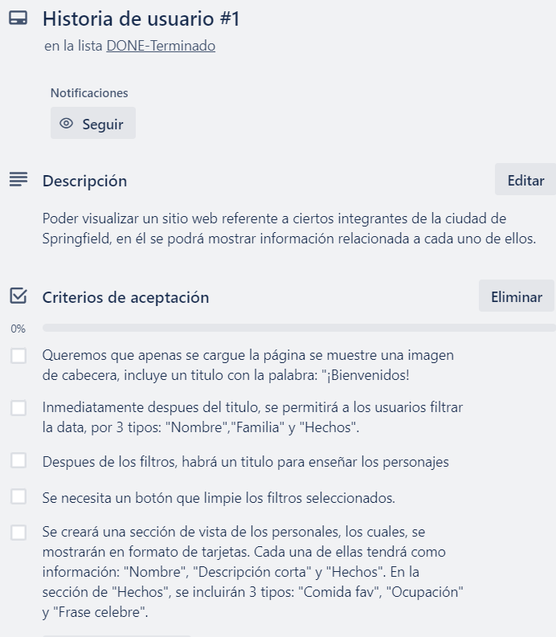
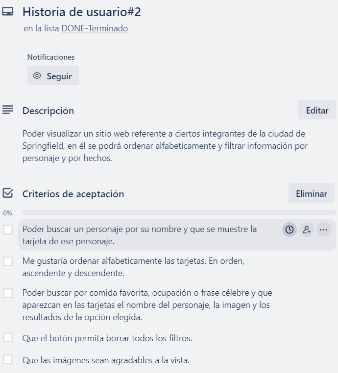
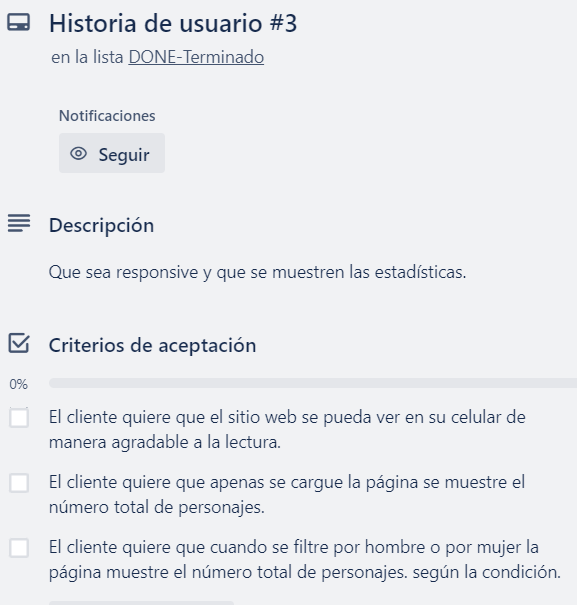
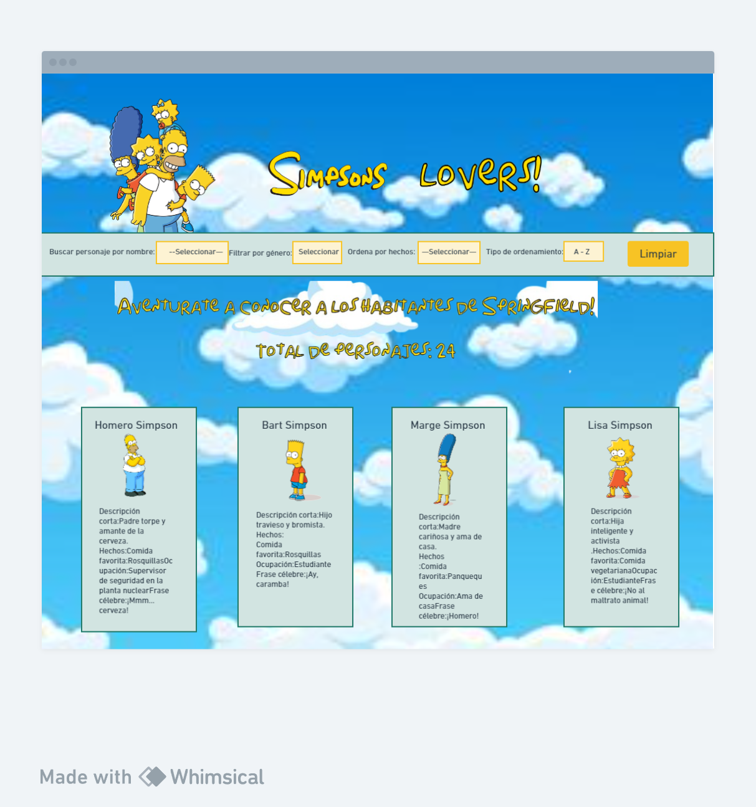

# Simpsons lovers

## Índice

- [1. Resumen del proyecto](#1-resumen-del-proyecto)
- [2. Proceso de diseño](#2-proceso-de-diseño)
- [3. Funcionalidades](#3-funcionalidades)
- [4. Cómo leer el proyecto](#4-cómo-leer-el-proyecto)
- [5. Problema de usabilidad](#5-problema-de-usabilidad)

---

## 1. Resumen del proyecto

Simpsons lovers una página web interactiva para escritorio y móvil, que permite a los usuarios visualizar y explorar un conjunto de datos sobre los personajes de la serie. Los datos se generarán mediante el uso de la herramienta de inteligencia artificial llamado ChatGPT.
El objetivo principal de este proyecto es el conocimiento en la manipulación de datos, se busca permitir a los usuarios filtrar, ordenar y realizar cálculos estadísticos sobre los datos para obtener información relevante sobre los personajes.

## 2. Proceso de diseño

Comenzamos a pensar el diseño y realizamos los bocetos de baja fidelidad, tanto de desktop como de mobile.

.png>)
.png>)

Usamos chatGPT para generar un set de datos en un archivo javascript.

.png>)
.png>)
.png>)
.png>)
.png>)
.png>)
.png>)
.png>)
.png>)
.png>)

Tuvimos en cuenta las siguientes historias de usuario.

El diseño fue cambiando en base a lo comentado por nuestras compañeras. Por ejemplo, se modificaron el fondo de los colores de las tarjetas
para que no se perdiera la imagen. Además, se cambió la ubicación de los nombres de los personajes. Se colocaron arriba de la imagen y se cambió la tipografía.
Con respecto al footer, se nos aconsejó que se agrandaran las letras y se cambiara la tipografía de la misma.
En cuanto a la versión mobile, se nos sugirió que a la sección de filtros se le agregara un color de fondo que los contenga para que no se perdiera con la imagen del sitio web.
También, realizamos cambios que nos parecieron más agradables a la vista. Cambiamos la imagen superior y agregamos un título. 
Estos son los diseños de alta fidelidad, tanto de la versión desktop como de la versión mobile:

.png)

Así se puede visualizar el sitio web actualmente:

## 3. Funcionalidades

Este sitio web cuenta con diferentes filtros. El primero busca por personaje y funciona de la siguiente manera: se selecciona un nombre y al hacer click, aparecerá en pantalla la tarjeta del personaje seleccionado. Para realizar este filtro se creó una función pura utilizando el método filter. Este método devuelve un array de objetos que cumple con la condición solicitada.Además, se utilizó un eventListener que escucha el evento y se guardó en una variable el valor del personaje elegido, llamando a la función de filtrado.
El siguiente filtro que podemos visualizar es el de seleccionar por género. Al elegir femenino o masculino, se imprimen en pantalla las tarjetas que correspondan al género seleccionado. Para este filtro también se utilizó la función pura creada con el método filter y es muy similar a la anterior. La única diferencia es que recibe como segundo parámetro el género.
A su derecha se puede visualizar el filtro que selecciona por hechos:comida favorita,ocupación y frase célebre. Este filtro va de la mano con el filtro que ordena alfabeticamente. Al elegir un hecho y la manera de ordenarlo(ascendente y descendente), se renderiza alfabeticamente según el hecho seleccionado. Para este filtro se creó otra función pura que utiliza el método sort. Dicho método ordena los elementos de un array. También se utilizó un evenListener para escuchar el evento.
Por otro lado, tenemos el botón de limpiar. Al hacer click a este botón, se renderizan las tarjetas como se encontraban al ingresar a la página. Para realizarlo, se utilizó un eventListener y también como en los filtros anteriores, un appendChild que renderiza la data.
Por último este sitio web muestra distintas estadísticas. Muestra la cantidad total de personajes, que se realizó utilizando un data.length. También, calcula el total de personjes tanto femeninos como masculinos. Para esto, se creó una función que utiliza el método map y reduce. El método map devuelve un array con el tipo de datos seleccionado y el método reduce devuelve un único valor.

## 4. Cómo leer el proyecto

Este proyecto sigue una estructura organizada para facilitar el desarrollo y mantenimiento del código. A continuación, se describe el contenido de los archivos principales:

  ### src/index.html:
  
  Este archivo representa la página que se mostrará a los usuarios. Además, se utiliza para importar y vincular todos los scripts necesarios para el proyecto.

  ### src/main.js:

  En este archivo, se recomienda colocar todo el código relacionado con la interacción con el Document Object Model (DOM). Esto incluye la creación de nodos HTML, registro de manejadores de eventos (event listeners o event handlers) y cualquier lógica que afecte la visualización de datos en la pantalla.

  ### src/dataFunctions.js:

  Contiene todas las funciones puras que se encargan de obtener, procesar y manipular datos. Algunos ejemplos de funciones incluyen:
    * filterData(data, filterBy, value): para filtrar datos según ciertos criterios.
    * sortData(data, sortBy, sortOrder): para ordenar datos dependiendo de una condición.
    * computeStats(data): para realizar cálculos estadísticos básicos.

  ### src/data:

  Almacena la data que se usa para la página.

  ### test/dataFunctions.spec.js:

  En este archivo, se encuentran las pruebas unitarias para las funciones implementadas en dataFunctions.js.

  ### test/data.js:

  Permite almacenar una pequeña data que se utiliza en las pruebas. 
  
  ### src/view.js:

  Este archivo se encarga de manejar la renderización de elementos de manera dinámica en la página web.

## 5. Problema de usabilidad

Los usuarios deben seguir un orden especifico para que puedan funcionar correctamente los filtros, es decir, debe aplicarse primero un genero, luego especificar qué hecho quieres ordenar y posteriormente elegir si quieres verlos de manera ascendente o descendente.